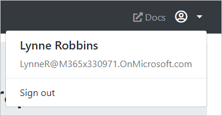

<!-- markdownlint-disable MD002 MD041 -->

在本练习中，你将扩展上一练习中的应用程序，以支持 Azure AD 的身份验证。 若要获取所需的 OAuth 访问令牌以调用 Microsoft Graph，这是必需的。 在此步骤中，将 [Microsoft 身份验证库](https://github.com/AzureAD/microsoft-authentication-library-for-js) 库集成到应用程序中。

1. 在名为 **config.js** 的根目录中创建一个新文件，并添加以下代码。

    :::code language="javascript" source="../demo/graph-tutorial/config.example.js" id="msalConfigSnippet":::

    将替换 `YOUR_APP_ID_HERE` 为应用程序注册门户中的应用程序 ID。

    > [!IMPORTANT]
    > 如果您使用的是源代码管理（如 git），现在可以从源代码管理中排除 **config.js** 文件，以避免无意中泄漏您的应用程序 ID。

1. 打开 **auth.js** 并将以下代码添加到文件的开头。

    :::code language="javascript" source="../demo/graph-tutorial/auth.js" id="authInitSnippet":::

## <a name="implement-sign-in"></a>实施登录

在本节中，您将实现 `signIn` 和 `signOut` 函数。

1. 将现有的 `signIn` 函数替换为以下内容。

    ```javascript
    async function signIn() {
      // Login
      try {
        // Use MSAL to login
        const authResult = await msalClient.loginPopup(msalRequest);
        console.log('id_token acquired at: ' + new Date().toString());
        // Save the account username, needed for token acquisition
        sessionStorage.setItem('msalAccount', authResult.account.username);
        // TEMPORARY
        updatePage(Views.error, {
          message: 'Login successful',
          debug: `Token: ${authResult.accessToken}`
        });
      } catch (error) {
        console.log(error);
        updatePage(Views.error, {
          message: 'Error logging in',
          debug: error
        });
      }
    }
    ```

    在成功登录后，此临时代码将显示访问令牌。

1. 将现有的 `signOut` 函数替换为以下内容。

    :::code language="javascript" source="../demo/graph-tutorial/auth.js" id="signOutSnippet":::

1. 保存更改并刷新页面。 登录后，您应该会看到一个显示访问令牌的错误框。

## <a name="get-the-users-profile"></a>获取用户的配置文件

在本节中，您将改进 `signIn` 函数，以使用访问令牌从 Microsoft Graph 获取用户的配置文件。

1. 在 **auth.js** 中添加以下函数以检索用户的访问令牌。

    :::code language="javascript" source="../demo/graph-tutorial/auth.js" id="getTokenSnippet":::

1. 在名为 **graph.js** 的项目的根目录中创建一个新文件，并添加以下代码。

    :::code language="javascript" source="../demo/graph-tutorial/graph.js" id="graphInitSnippet":::

    此代码创建auth.js中包装方法的授权提供程序 `getToken` ，并使用此提供程序初始化 Graph 客户端。 ****

1. 在 **graph.js** 中添加以下函数，以获取用户的配置文件。

    :::code language="javascript" source="../demo/graph-tutorial/graph.js" id="getUserSnippet":::

1. 将现有的 `signIn` 函数替换为以下内容。

    :::code language="javascript" source="../demo/graph-tutorial/auth.js" id="signInSnippet":::

1. 保存更改并刷新页面。 登录后，应返回到主页，但 UI 应更改，以指示您已登录。

    

1. 单击右上角的用户头像以访问 " **注销** " 链接。 单击 " **注销** " 重置会话并返回到主页。

    

## <a name="storing-and-refreshing-tokens"></a>存储和刷新令牌

此时，您的应用程序具有访问令牌，该令牌是在 `Authorization` API 调用的标头中发送的。 这是允许应用代表用户访问 Microsoft Graph 的令牌。

但是，此令牌的生存期较短。 令牌在发出后会过期一小时。 这就是刷新令牌变得有用的地方。 刷新令牌允许应用在不要求用户重新登录的情况下请求新的访问令牌。

由于应用程序使用的是 MSAL 库，因此您无需实现任何令牌存储或刷新逻辑。 MSAL 在浏览器会话中缓存令牌。 该 `acquireTokenSilent` 方法首先检查缓存的标记，如果它未过期，它将返回。 如果它已过期，则使用缓存的刷新令牌获取新的。 Graph 客户端对象在 `getToken` 每次请求时调用 **auth.js** 的方法，以确保它具有最新的令牌。
